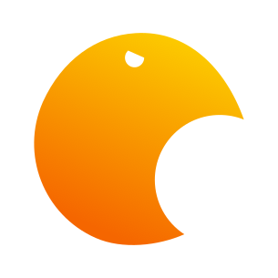

<div align="center">
  
</div>

# Sunbird

[](https://github.com/radeqq007/Sunbird/actions/workflows/build.yml)
[](https://github.com/radeqq007/Sunbird/actions/workflows/tests.yml)
[](https://github.com/radeqq007/Sunbird/actions/workflows/golangci-lint.yml)
[](https://codecov.io/gh/radeqq007/sunbird)


> [!CAUTION]
> Sunbird is currently under a big rewrite.
> The documentation is outdated and code examples might not work.
> 
Sunbird is a transpiled programming language that targets TypeScript and focuses on **ease of use** and **clarity**.

For detailed language reference, standard library docs, and guides, see the [`docs/`](./docs) directory.


## Overview

### Hello world in Sunbird
```ts
console.log("Hello, world!") // Sunbird is compatible with javascript's standard library
```

### Defining variables and functions
```ts
let a = 1
const b: Int = 2

const add = func(a: Int, b: Int): Int {
    return a + b
}

add(a, b)
```

### String interpolation
```ts
const greet = func(name: String) {
  console.log("Hello, $name")
}

greet("John")
```

### Control flow
```ts
let a = 1
let b = 2

if a > b {
    console.log("a is greater than b")
} else if a < b {
    console.log("a is less than b")
} else {
    console.log("a is equal to b")
}

for i in 0..10 {
    console.log(i)
}

while a <= b {
    console.log(a)
    a += 1

    if a == 1 {
      continue
    }

    if a == 2 {
      break
    }
}

try {
    let c = 1 / 0
} catch e {
    console.log(e)
} finally {
    console.log("finally")
}

```

### Type annotations
```ts
let a: Int = 1
let b: Float = 2.0
let c: String = "hello"
let d: Bool = true
let e: Void = null
let f: Array = [1, 2, 3]
let g: Func = func(a: Int, b: Int): Int {
  return a + b
}
let h: Hash = {1: 1, 2: 2, 3: 3}


// Nullable types
let i: Int? = null
let j: String? = "hello"
let d: Bool? = true
let e: Array? = [1, 2, 3]
let f: Func? = func(a: Int, b: Int): Int {
    return a + b
}
let g: Hash? = {1: 1, 2: 2, 3: 3}
```
